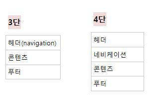
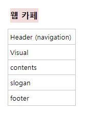
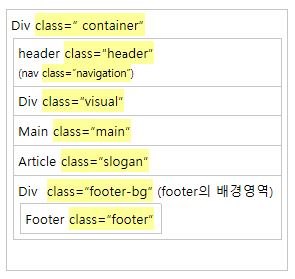

# 190401\_웹, 웹 접근성, html구조

웹 접근성과 웹 표준

https://seulbinim.github.io/WSA/

웹 사이트에서 제공하는 정보를 차별 및 제한 없이 동등하게 이용할 수 있도록 보장하는 것

`항상 크롬, 파이어폭스 등 크로스 브라우징 확인`

## 1. 웹(world wide web)

`who` : Tim Berners Lee  
`why` :멀리 떨어져 있는 여러 사람들을 연결시키기 위해  

백엔드, 프론트엔드  
    `back-end` : server, database, application layer  
    `front-end`: client, web browser, presentation layer

    Front-end
    html5 : 건강한 신체
    css : 근사한 스타일링
    javascript : 스마트한 두뇌

### web accessibility(웹 접근성)

1. 사람에 대한 이해  
    장애를 가진 사람의 경우  
    ex. iphone - voice over
    '장애인에게 필요한 것은 현실적인 IT 기술' (꼭 장애인에게민 국한된 것은 아니다.) / 카푸친 원숭이

2. 환경에 대한 이해  
    cross browsing (다양한 platform을 고려해야 한다.)
    SEO(search engine optimization)  
    저사양 또는 저속회선

## html5

`!, html:5` - emmet 단축키  
lang 속성은 접근성 관점에서 필요하다.

html 3.0에서 close tag를 삭제하거나 대소문자 구분을 하지 않는 것이 단점
-> xml을 만들어냄 : 위의 단점을 보완, 특정 태그가 논리 속성을 가질 수 있음  
xml + html4 = XHTML 1.0

## 웹 사이트 구조 짜기

웹사이트는 일반적으로 `3단구조 vs 4단` 구조로 짠다.



### 1. 선형화 (구조)

    웹 카페 : 3단을 기준으로 5단 구성


`디자인에 종속해서 마크업하지 않고 논리적인 순서로 마크업하기`

### 2. Sementic element
해당 요소에 어떤 내용이 담겨 있는지, 무슨 목적으로 사용되었는지를 쉽게 알 수 있다. (태그가 의미를 가짐)

`<header>` : 머리글, 메뉴  
`<nav>` : 네비게이션, 링크 모음  
`<footer>` : 바닥글  
`<article>`, `<section>`, `<aside>`, `<time>`, `<address>`, `<figure>`

#### Article, section, div의 차이

| Article | section | Div |
|---|:---:|---:|
|`제목을 가져야 한다.` |`제목을 가져야 한다.` |제목이 없어도 된다.|
|독립적이고 개별적인 콘텐츠를 담는다. |페이지 내에서 서로 관계 있는 문서를 분리하는 역할, 콘텐츠 자체로 독립적이고 완전하고 개별적이지 않다. |콘텐츠들이 서로 의미적으로 관련이 없을 때 사용한다.|
|콘텐츠가 독립적일 때 의미가 통하는가? 를 중점으로 생각해보아야 한다.|특징을 가지고 영역을 나눌 수 있는 요소들| |
|Ex. 블로그 내의 포스팅 글, 댓글 영역 |Ex. 책에서 $장(chapter) |Ex. 영역에 style을 입히는 경우 |

`WAI - ARIA`  
W3C에서 권고하는 RIA에 대한 웹 접근성 표준 (논리적인 구조 설계가 되어 있지 않을 때 사용)  
Role 속성을 모든 태그에 사용할 수 있음, grouping  
Role =”banner” header와 같은 역할  

```
ex. a(href) : 구매하기, role =”button”

하지만 button 태그를 사용하는 것이 접근성 측면에서 좋다.
```

### 3. naming
naming을 할 때 주로 id보다는 class를 사용한다.  
그리고 콘텐츠를 나타낼 수 있는 의미있는 class name으로 지정한다. 

#### 표기법

ex. Main content  
`Pascal case` : MainContent  
`Camel case` : mainContent  
`Snake case` : main_content  
`Cabab case` : main-content  

#### 웹카페 naming


