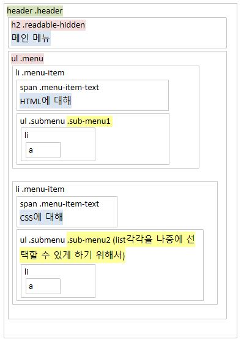
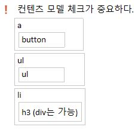
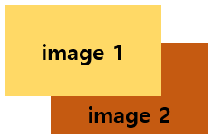

# 190404_nav, 웹 콘텐츠 접근성 지침, animation


## 웹카페 nav 구조


### nav 요소 
링크를 nav로 묶을 수도 있다.  
하지만 nav 요소를 많이 사용하는 것은 좋지 않다.

### 컨텐츠 모델상 잘못된 문법


### background–image 속성
참고 : https://seulbinim.github.io/WSA/color-background.html#background%E2%80%93color-%EC%86%8D%EC%84%B1

여러 개의 배경 이미지를 지정할 때 배경 이미지의 겹치는 순서는 `가장 먼저 작성한 이미지가 가장 위쪽에 위치`

**background 이미지 배치 순서**


```css
.class{ 
    background : image1 image 2 
}
```

### Gradient 효과


```css
.menu {
    background: #e55700
        linear-gradient(
            to bottom,
            #f7883d 0%,
            #e55700 35%,
            #e55700 70%,
            #f7883d 100%
        );
}
```

`앞 color` : 배경 색  
`뒤 color `: 배경 image  
background image가 없으면 그냥 주황색(#e55700)이 보이게 된다.

### float & absolute는 같이 쓸 수 있을까?
둘다 default값을 갖고 있기 때문에 같이 사용이 가능하다.  

<br>

### float & flex의 차이
`float`는 `over`시 줄바꿈이 가능하다.  
`flex`는 `over`시 줄바꿈이 되지 않는다. (flex-wrap : wrap을 사용하면 줄바꿈이 가능하다.)

<br>

**float : left**
```css
    .menu li {
    float: left;
}
```

